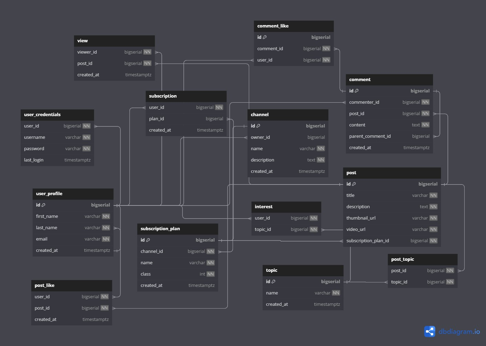

# Video Sharing System REST API Written With Golang + Postgres

## Use-cases
1. Users can log in or register with email and password
2. Users can create channels
3. Users can modify their channels
4. Channels can upload videos
5. Channels can modify their videos
6. Channels can choose topics for their videos, and videos can have multiple topics
7. Users can view videos in channels
8. Channels can create subscription plans (free or paid)
9. Users can subscribe to channel (default to free plan)
10. Users can pay for subscription plans
11. Users can view their subscriptions
12. Users only have access to videos that posted for their subscription plan
13. Users can view, like, and comment on videos
14. Users can view, like, and comment on comments
15. Users can view, like, and comment on replies
16. Users can set their interests (an interest refers to a topic that a user want to see videos about)
17. Users can filter videos based on their interests

## Database Diagram
